# 书生·浦语大模型实战课（第一节）

ps：

bilibili：
<https://www.bilibili.com/video/BV1Rc411b7ns/?vd_source=8655a5073cedacde79c21857f5ff1c83>

github：
<https://github.com/InternLM/tutorial>

***

**专用模型：针对特定任务，一个模型解决一个问题**

**通用大模型：一个模型应对多种任务、多种模态**（chatgpt4）

## 书生·浦语大模型

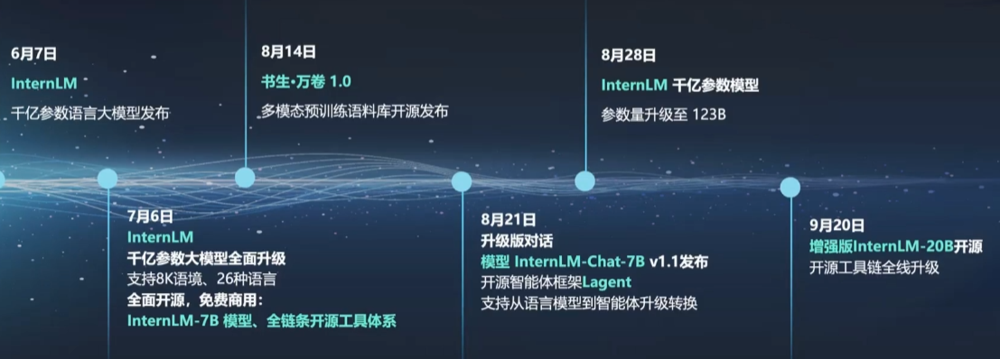

**轻量级：InternLM-7B**

-   70亿模型参数，小巧轻便，便于部署
-   10000亿训练token数据信息全面，能力多维
-   具备长语境能力，支持8k语境窗口长度
-   具备通用工具调用能力，支持多种工具调用模板

**中量级：InternLM-20B**

-   200亿参数量，在模型能力与推理代价间取得平衡
-   采用深而窄的结构，降低推理计算量但提高了推理能力
-   4k训练语境长度，推理时可外推至16k

**重量级：InternLM-123B**

-   1230亿模型参数，强大的性能
-   具备极强的推理能力、全面的知识覆盖面、超强理解能力与对话能力
-   准确的API调用能力，可实现各类Agent

初学者可能对LLM的参数和类型没有一个具体估计，可以参考下面这篇文章

> 常识：LLM 参数 / 类型 / 显存 估算：
>
> [<https://zhuanlan.zhihu.com/p/648163625#:~:text=%E6%8E%A8%E7%90%86%EF%BC%9A%E6%98%BE%E5%AD%98%20%E8%99%BD%E7%84%B6%E8%BF%98%E6%9C%89%E5%85%B6%E4%BB%96%E5%9B%A0%E7%B4%A0%E4%B9%9F%E4%BC%9A%E7%94%A8%E5%88%B0%E6%98%BE%E5%AD%98%EF%BC%8C%E4%BD%86%E6%97%A0%E7%96%91%E6%8E%A8%E7%90%86%E7%9A%84%E6%98%BE%E5%AD%98%E5%A4%A7%E5%A4%B4%E5%B0%B1%E6%98%AF%20%E5%8F%82%E6%95%B0%EF%BC%9B%20%E4%BB%A5%20Qwen-7B-BF16%20%E7%89%88%E6%9C%AC%E4%B8%BA%E4%BE%8B%EF%BC%8C%E9%9C%80%E8%A6%81%E6%98%BE%E5%AD%98%20%253D%20%E6%95%B0%E9%87%8F>, *%20%E7%B1%BB%E5%9E%8B%E5%A4%A7%E5%B0%8F%20%253D%2070%E4%BA%BF%20*%202%E5%AD%97%E8%8A%82%20%253D%20140%E4%BA%BF%E5%AD%97%E8%8A%82](https://zhuanlan.zhihu.com/p/648163625#:~:text=%E6%8E%A8%E7%90%86%EF%BC%9A%E6%98%BE%E5%AD%98%20%E8%99%BD%E7%84%B6%E8%BF%98%E6%9C%89%E5%85%B6%E4%BB%96%E5%9B%A0%E7%B4%A0%E4%B9%9F%E4%BC%9A%E7%94%A8%E5%88%B0%E6%98%BE%E5%AD%98%EF%BC%8C%E4%BD%86%E6%97%A0%E7%96%91%E6%8E%A8%E7%90%86%E7%9A%84%E6%98%BE%E5%AD%98%E5%A4%A7%E5%A4%B4%E5%B0%B1%E6%98%AF%20%E5%8F%82%E6%95%B0%EF%BC%9B%20%E4%BB%A5%20Qwen-7B-BF16%20%E7%89%88%E6%9C%AC%E4%B8%BA%E4%BE%8B%EF%BC%8C%E9%9C%80%E8%A6%81%E6%98%BE%E5%AD%98%20%253D%20%E6%95%B0%E9%87%8F,*%20%E7%B1%BB%E5%9E%8B%E5%A4%A7%E5%B0%8F%20%253D%2070%E4%BA%BF%20*%202%E5%AD%97%E8%8A%82%20%253D%20140%E4%BA%BF%E5%AD%97%E8%8A%82)
>
> -   1B = 1000 M，十亿；
> -   7B参数的模型推理（BF16）估计需要显存：14GB
> -   7B参数的模型训练（float）估计需要显存：112GB

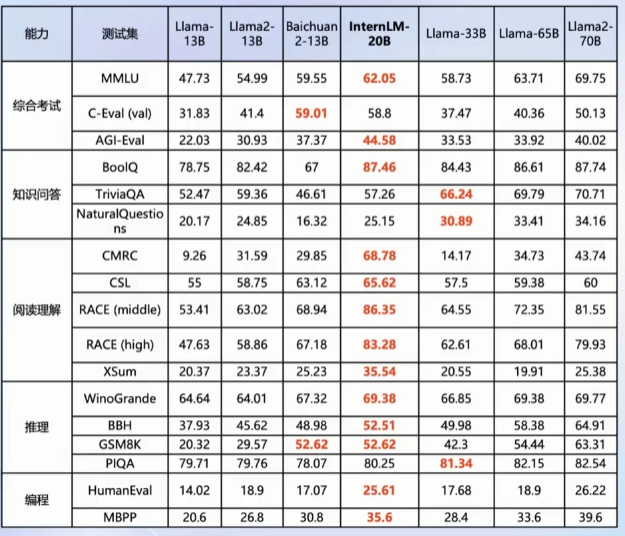

## 从训练到部署

应用方向：

-   智能客服
-   个人助手
-   行业应用

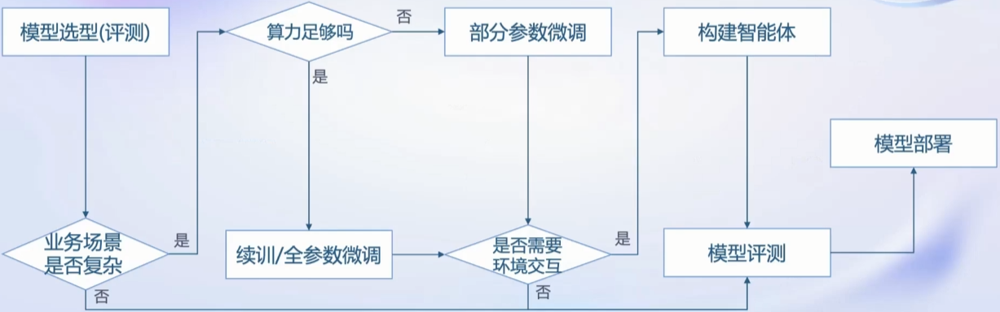

从训练到应用存在很多困难

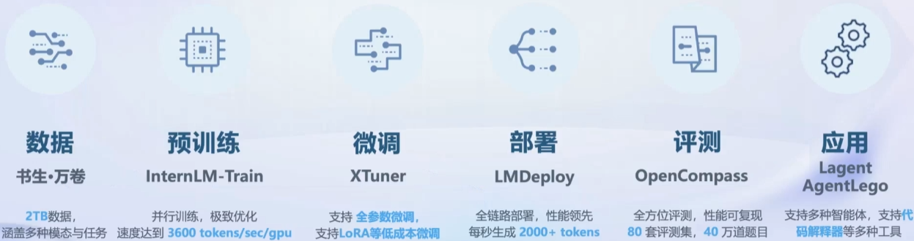

### 数据

文本数据：

-   50亿个文档
-   数据量超1TB

图像-文本数据集

-   超2,200万个文件
-   数据量超140GB

视频数据

-   超1,000个文件
-   数据量超900GB

**多模态融合**

万卷包含文本、图像和视频等多模态数据，涵盖科技、文学、媒体、教育和法律等多个领域。该数据集对模型的知识内容、逻辑推理和泛化能力的提升有显著效果。

**精细化处理**

万卷经过语言筛选、文本提取、格式标准化、数据过滤和清洗（基于规则和模型）、多尺度去重和数据质量评估等精细数据处理环节，能够很好地适应后续模型训练的要求。

**价值观对齐**

在万卷的构建过程中，研究人员注重将数据内容与主流中国价值观进行对齐，并通过算法和人工评估的结合提高语料库的纯净度。

### 预训练（InternLM-Train)

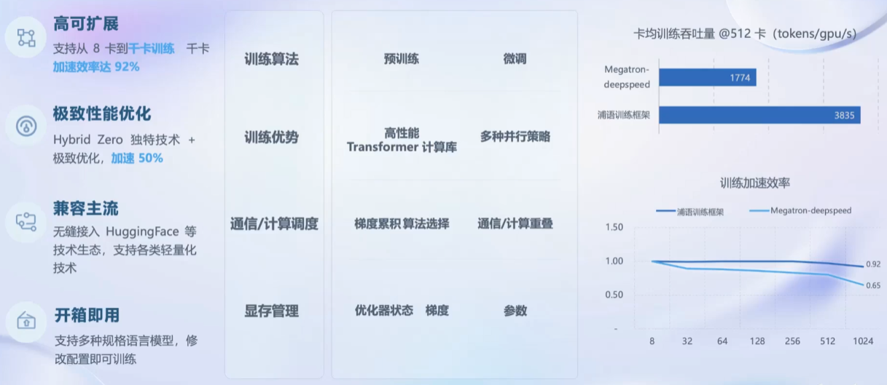

### 微调（XTuner）

大语言模型的下游应用中，增量续训和有监督微调是经常会用到两种方式。

#### 增量续训

使用场景：让基座模型学习到一些新知识，如某个垂类领域知识训练数据：文章、书籍、代码等

#### 有监督微调

使用场景：让模型学会理解和遵循各种指令，或者注入少量领域知识Pretrained训练数据：高质量的对话、问答数据&#x20;

微调框架

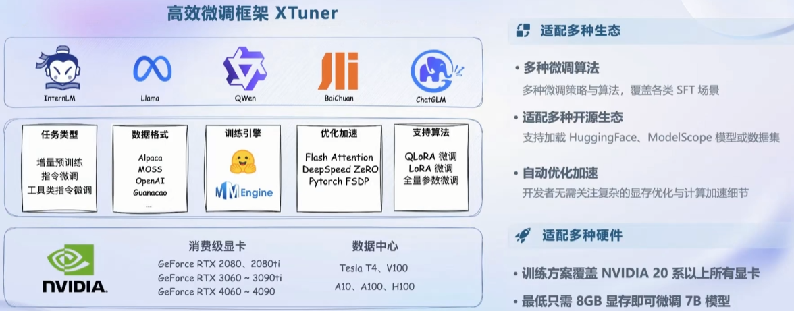

微调统计

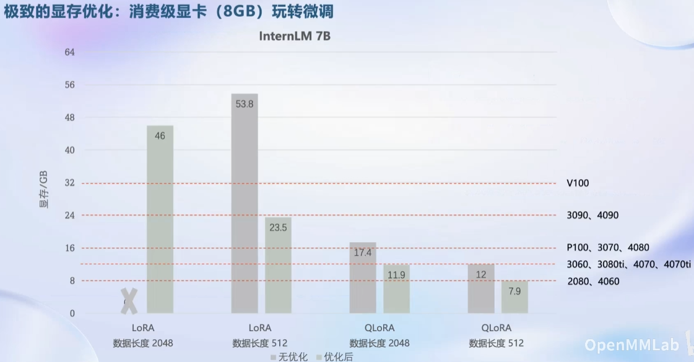

### 评测（OpenCompass）

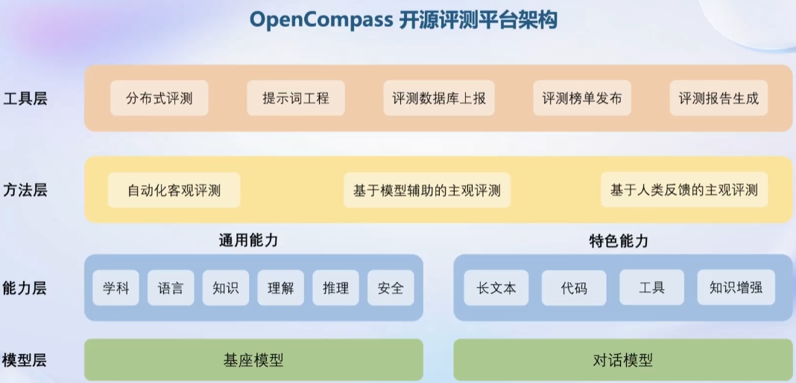

> 参考：
>
> <https://zhuanlan.zhihu.com/p/652688939>

### 部署（LMDeploy)

难点：

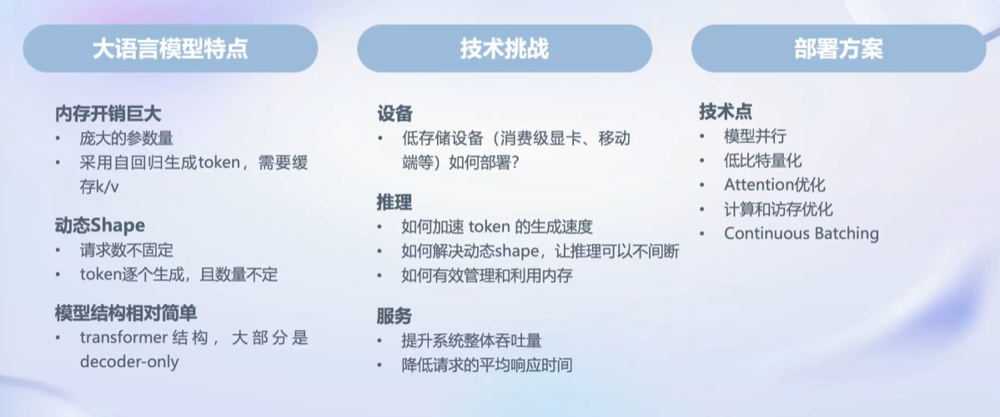

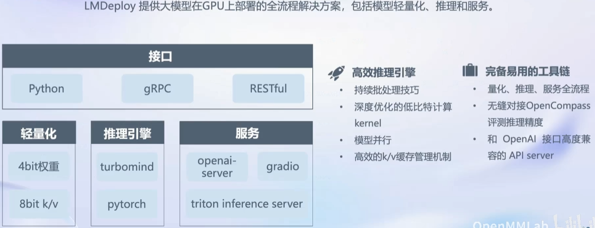

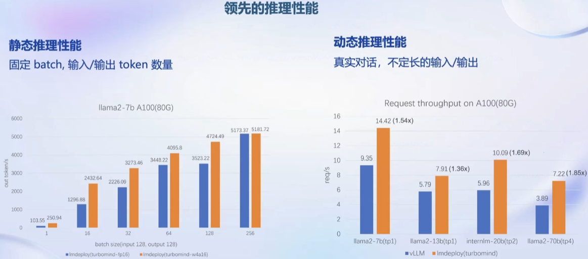

### 智能体（Lagent）

大语言模型的局限性：

-   最新信息和知识的获取
-   回复的可靠性
-   数学计算
-   工具使用和交互

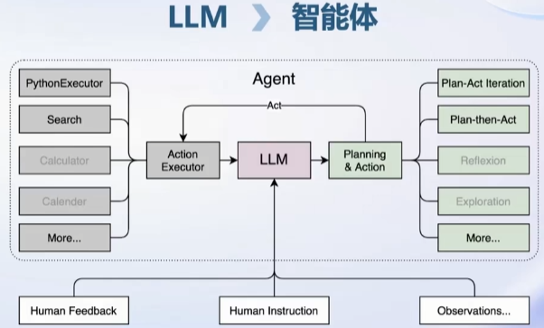

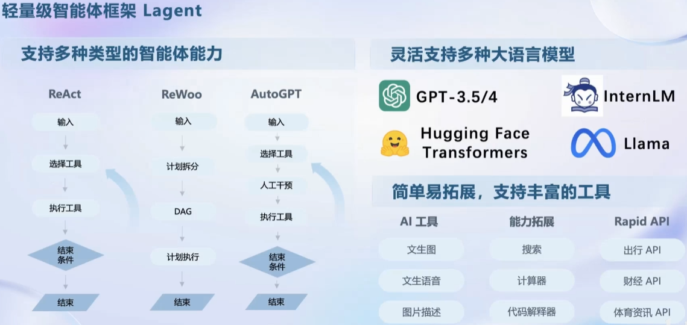

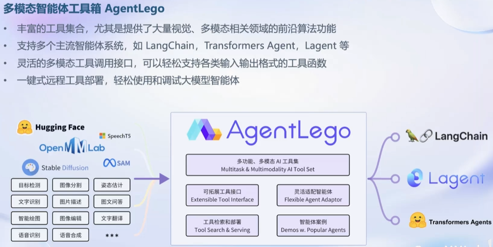

---
end
