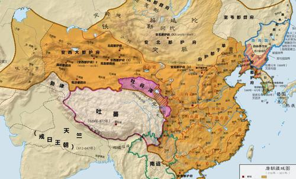
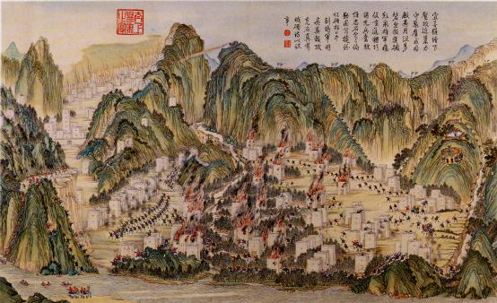
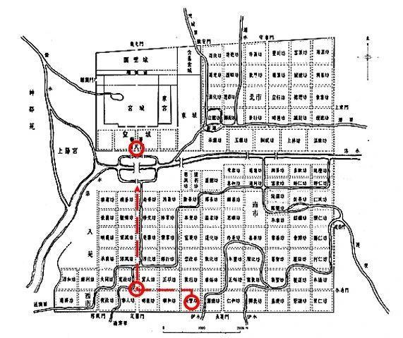
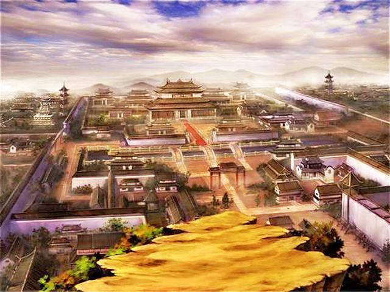

大唐长安，是中国历史上最辉煌的朝代之一。它不仅在政治、经济、文化等方面取得了巨大的成就，而且在城市规划和建筑艺术方面也达到了前所未有的高度。今天，我们就来一起探索一下这座伟大城市的魅力所在。

  

**一、历史背景**

唐朝是中国历史上最强盛的朝代之一，其鼎盛时期被称为“贞观之治”。唐太宗李世民在位期间，采取了一系列改革措施，使得国家繁荣昌盛，人民安居乐业。在他的领导下，唐朝的政治、经济、文化等各个方面都得到了极大的发展。为了纪念这位伟大的皇帝，人们将他的年号定为“贞观”，并在此基础上建立了一座宏伟的城市——大唐长安。

  

**二、地理环境**

大唐长安位于陕西省西安市境内，地处关中平原中部，北依秦岭，南临渭水，地势平坦，交通便利。这里气候温和，四季分明，雨量充沛，非常适合农业生产。此外，西安还拥有丰富的历史文化资源，如兵马俑、华清池、大雁塔等名胜古迹，吸引了无数游客前来参观游览。

  

**三、城市规划**

大唐长安是当时世界上规模最大的城市之一，它的建成标志着中国古代城市规划的最高水平。整个城市分为内外两城，外城为皇城，内城为宫城。皇宫周围有城墙环绕，城门四通八达，交通十分便利。街道宽阔整齐，店铺林立，商贾云集，形成了繁华热闹的商业区。除此之外，还有众多的寺庙、书院、公园等公共设施，为市民提供了丰富多彩的文化生活。

  

**四、建筑艺术**

大唐长安的建筑艺术堪称世界一流，无论是宫殿、庙宇、园林还是民居，都具有极高的艺术价值。其中最著名的当属大明宫和大雁塔了。大明宫始建于隋文帝开皇三年（公元583年），历经隋、唐、五代、宋、元、明、清等多个朝代的修缮扩建，最终成为一座气势恢宏的大型宫殿群。而大雁塔则是唐代著名诗人白居易所建的一座佛塔，至今仍屹立在大雁塔广场上，成为西安市的标志性建筑之一。除了这些著名的建筑之外，还有许多精美的壁画、雕塑、石刻等艺术作品，充分展现了古代劳动人民的智慧和创造力。

  

**五、文化内涵**

大唐长安不仅是物质财富的聚集地，更是精神文化的宝库。在这里，各种宗教信仰和谐共存，佛教、道教、儒教等多种文化相互交融，形成了多元化的文化氛围。同时，这里的文学、音乐、舞蹈、绘画等艺术门类也非常发达，涌现出了一大批杰出的艺术家和文学作品。例如《长恨歌》、《霓裳羽衣曲》、《琵琶行》等都是脍炙人口的名篇佳作。总之，大唐长安是一座充满传奇色彩的历史名城，它在政治、经济、文化等方面的成就令人叹为观止。如今，这座古老的城市依然散发着迷人的魅力，吸引着越来越多的游客前来观光旅游。<TOKENS_UNUSED_1>

  

<TOKENS_UNUSED_1><TOKENS_UNUSED_1><TOKENS_UNUSED_1><TOKENS_UNUSED_1><TOKENS_UNUSED_1><TOKENS_UNUSED_1><TOKENS_UNUSED_1><TOKENS_UNUSED_1><TOKENS_UNUSED_1><TOKENS_UNUSED_1>