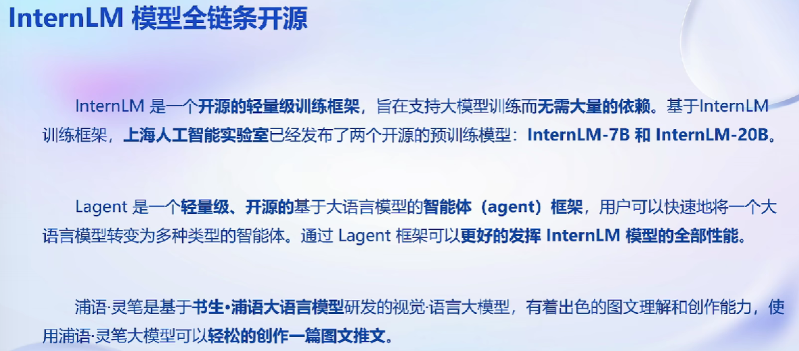
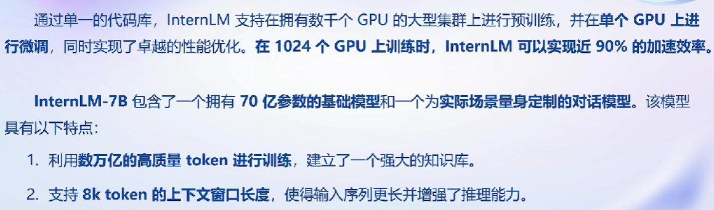
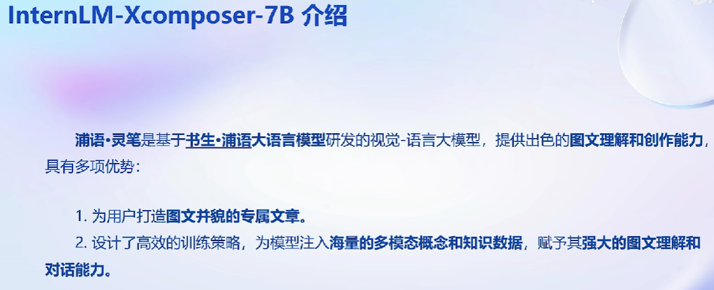
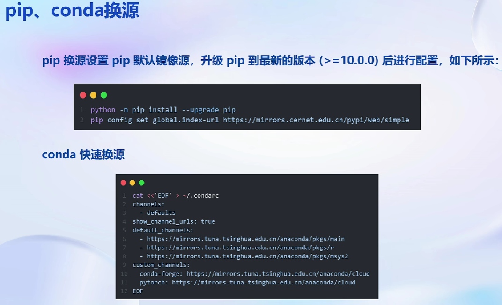
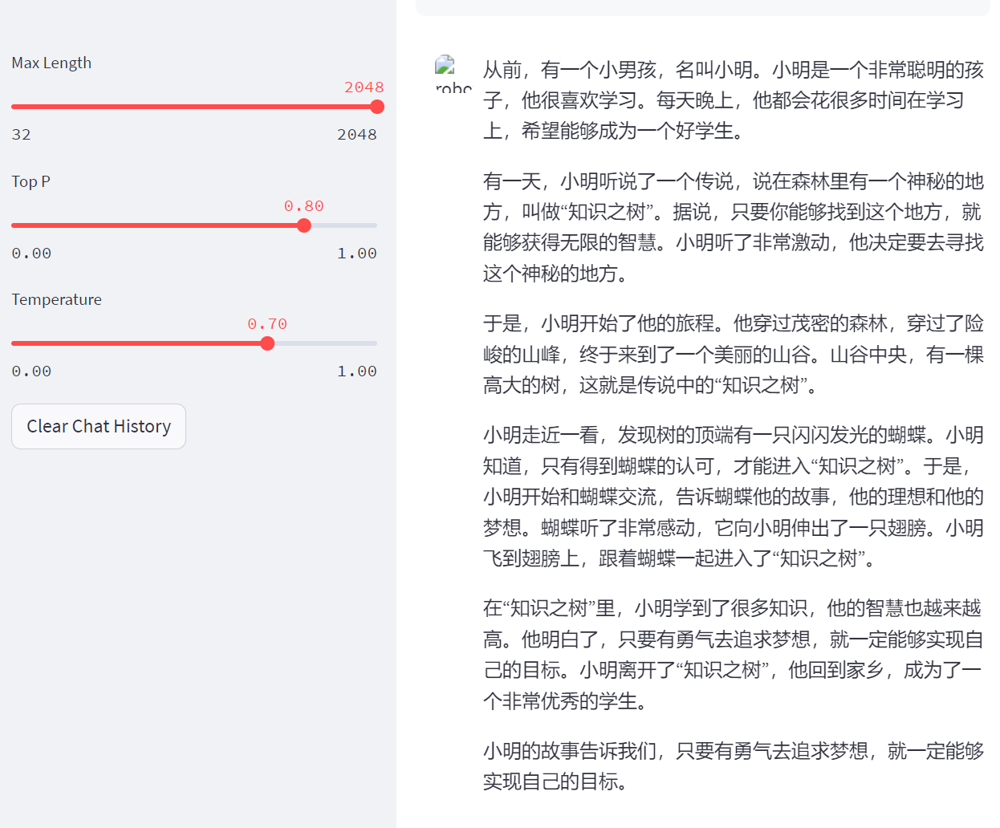
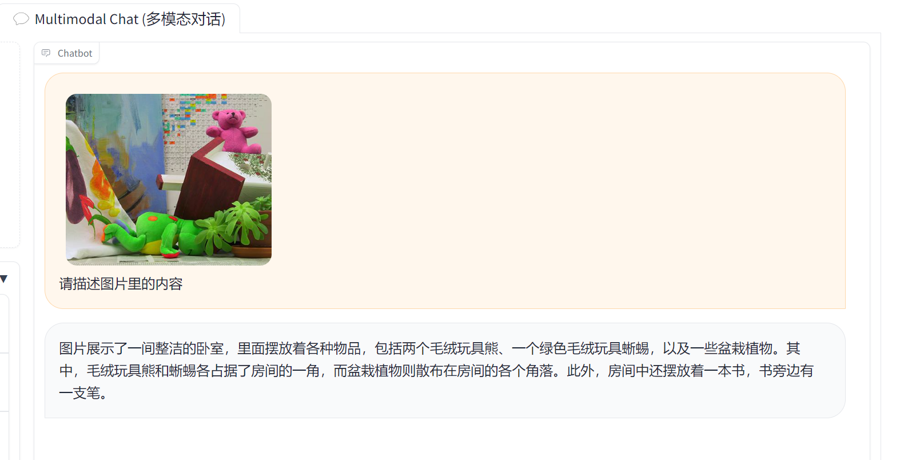
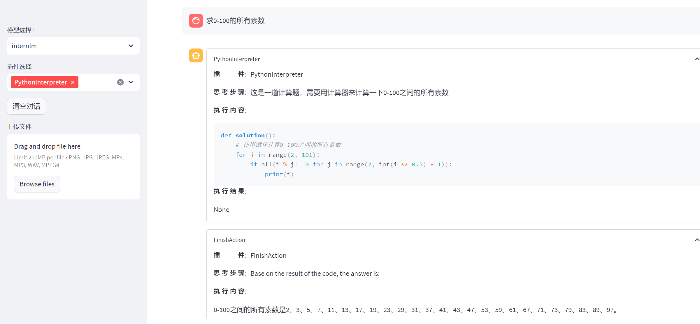
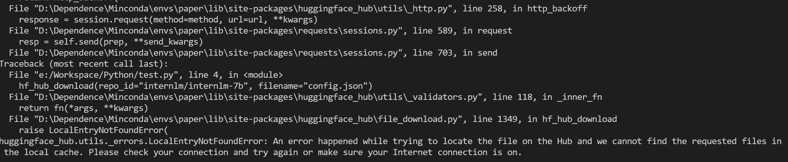

# 第二节

## 目录

-   [介绍](#介绍)
-   [实操](#实操)
    -   [下载模型](#下载模型)
-   [作业](#作业)
    -   [300字小故事](#300字小故事)
    -   [浦语·灵笔的图文理解及创作部署](#浦语灵笔的图文理解及创作部署)
    -   [Lagent 工具调用 Demo 创作部署](#Lagent-工具调用-Demo-创作部署)
    -   [悉 hugging face 下载功能](#悉-hugging-face-下载功能)

视频地址：[https://www.bilibili.com/video/BV1Ci4y1z72H/?vd\_source=8655a5073cedacde79c21857f5ff1c83](https://www.bilibili.com/video/BV1Ci4y1z72H/?vd_source=8655a5073cedacde79c21857f5ff1c83 "https://www.bilibili.com/video/BV1Ci4y1z72H/?vd_source=8655a5073cedacde79c21857f5ff1c83")

***

## 介绍







## 实操



```bash
pip install -i https://mirrors.cernet.edu.cn/pypi/web/simple some-package

python -m pip install --upgrade pip
pip config set global.index-url https://mirrors.cernet.edu.cn/pypi/web/simple

cat <<'EOF' > ~/.condarc
channels:
  - defaults
show_channel_urls: true
default_channels:
  - https://mirrors.tuna.tsinghua.edu.cn/anaconda/pkgs/main
  - https://mirrors.tuna.tsinghua.edu.cn/anaconda/pkgs/r
  - https://mirrors.tuna.tsinghua.edu.cn/anaconda/pkgs/msys2
custom_channels:
  conda-forge: https://mirrors.tuna.tsinghua.edu.cn/anaconda/cloud
  pytorch: https://mirrors.tuna.tsinghua.edu.cn/anaconda/cloud
EOF

```

### 下载模型

1.  使用 Hugging Face 官方提供的 `huggingface-cli` 命令行工具。安装依赖:
    ```bash
    pip install -U huggingface_hub
    ```
    然后新建 python 文件，填入以下代码，运行即可。
    -   resume-download：断点续下
    -   local-dir：本地存储路径。（linux 环境下需要填写绝对路径）
    ```bash
    import os

    # 下载模型
    os.system('huggingface-cli download --resume-download internlm/internlm-chat-7b --local-dir your_path')
    ```
2.  使用 `modelscope` 中的 `snapshot_download` 函数下载模型，第一个参数为模型名称，参数 `cache_dir` 为模型的下载路径。（注意：`cache_dir` 最好为绝对路径。）
    ```bash
    pip install modelscope==1.9.5
    pip install transformers==4.35.2
    ```
    在当前目录下新建 python 文件，填入以下代码，运行即可。
    ```bash
    import torch
    from modelscope import snapshot_download, AutoModel, AutoTokenizer
    import os
    model_dir = snapshot_download('Shanghai_AI_Laboratory/internlm-chat-7b', cache_dir='your path', revision='master')
    ```
3.  OpenXLab 可以通过指定模型仓库的地址，以及需要下载的文件的名称，文件所需下载的位置等，直接下载模型权重文件。

    使用python脚本下载模型首先要安装依赖，安装代码如下：`pip install -U openxlab` 安装完成后使用 download 函数导入模型中心的模型。
    ```bash
    from openxlab.model import download
    download(model_repo='OpenLMLab/InternLM-7b', model_name='InternLM-7b', output='your local path')
    ```

## 作业

### 300字小故事



### 浦语·灵笔的图文理解及创作部署



### Lagent 工具调用 Demo 创作部署

[创作的图文并茂文章](./io.MD)



### hugging face 下载功能

由于特殊原因，无法连接相关网站
---
end